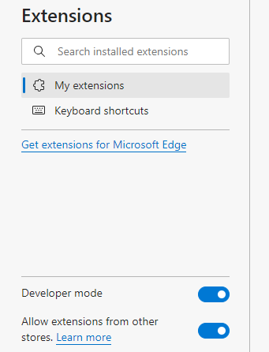

# JavaScript Executor Extension

JavaScript Script Executor Extension is a Microsoft Edge extension
designed to run a local JS script with a click of a button. processing.

## Usage

1.  Type edge://extensions/ in Edge’s address bar.

2.  Turn on “Developer mode” and “Allow extensions from other stores “on
    the left side of the page.

>  style="width:2.86697in;height:3.74976in"
> alt="A screenshot of a computer Description automatically generated" />

3.  Click Load unpacked on the top right of the page and select the
    project main directory.

4.  Click the extension button, which executes an example script that turns a page into dark mode and does some other element manipulations.

## Script Files

Change the file_path in background.js to execute your own custom
JavaScript Script files. The Script directory contains two examples.
